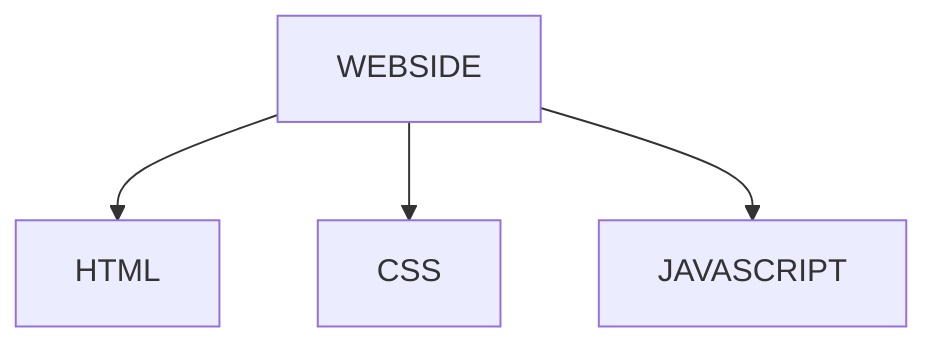

### 🙏 Hello Viewers 🙏

<h1 align="center">I'm Dhananjay Kumar</h1>
<h4 align="center">सोच का ही फ़र्क होता है, वरना समस्याएं आपको कमजोर नही बल्कि मज़बूत बनाने आती हैं…</h4>

<!-- **Dkumar-R/DKumar-R** is a ✨ _special_ ✨ repository because its `README.md` (this file) appears on your GitHub profile. -->

<!-- Here are some ideas to get you started: -->
<h3 align="center">🔭 I’m currently working on </h3>
<h2 align="center"> **JAVASCRIPT || REACT || HTML || CSS || NEXT JS || NODE JS || PYTHON** </h2>
<h3 align="center">🌱 I’m currently learning </h3>
<h2 align="center">JAVASCRIPT</h2>

- My favorite hobby - **Web Developer, Graphic Designing**
- Qualification - **B.SC-3**
    <h1></h1>
**Diagram For WEBSIDE**

